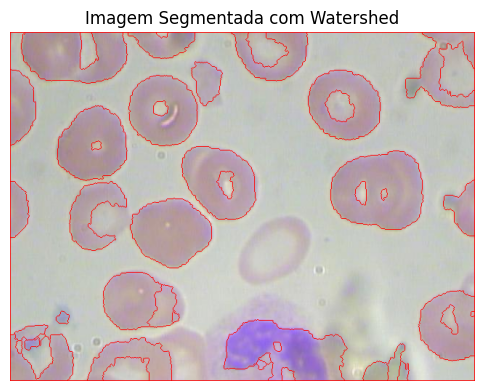

# 🧬 **Projeto de Classificação de Células com Processamento de Imagem**

Este projeto utiliza técnicas de **processamento de imagens** e **visão computacional** para realizar a **contagem e classificação de células** em imagens de microscópio. Os métodos aplicados envolvem detecção de bordas e transformadas para identificar e segmentar as células, permitindo avaliar o número de células presentes e suas características morfológicas.

## 🎯 **Objetivo**
- Desenvolver uma rotina para **segmentar** células utilizando técnicas de detecção de bordas (`Canny`) e transformadas (`Hough`) para contar e classificar as células.
- Avaliar o desempenho do método proposto em termos de **precisão** na detecção de células.

---

## 🛠 **Tecnologias e Ferramentas Usadas**
- **Linguagem:** Python 3.10.15
- **Bibliotecas:**
  - `OpenCV`: Para processar as imagens e aplicar técnicas de detecção e segmentação.
  - `NumPy`: Para manipulação de arrays e operações matemáticas.
  - `Matplotlib`: Para visualização dos resultados.

---

## 📂 **Estrutura do Projeto**
### **Arquivos e Diretórios**
- **`blood-cell-count-watershed`**: Notebook principal contendo:
  - **Carregamento e pré-processamento** das imagens de células.
  - **Segmentação** de células usando algoritmos de detecção de bordas e transformadas.
  - **Visualização** dos resultados e análise do desempenho do método.

---

## 🧠 **Métodos Implementados**
- **Detecção de Bordas com Canny:**
  - A técnica de detecção de bordas de Canny é usada para identificar as bordas das células na imagem, permitindo destacar os contornos para posterior segmentação.

- **Transformada de Hough para Detecção de Círculos:**
  - A **Transformada de Hough** é aplicada para identificar células que apresentam formato circular. Essa técnica é muito eficaz na detecção de objetos com formas geométricas bem definidas.

- **Operações Morfológicas:**
  - **Dilatação** e **erosão** são aplicadas para remover ruídos e melhorar a segmentação das células, facilitando a detecção precisa.

---

## 📊 **Resultados Encontrados**
Durante os experimentos, as técnicas de detecção de bordas e transformada de Hough foram aplicadas a diversas imagens de células, permitindo identificar e contar o número total de células presentes. Aqui estão os principais resultados encontrados:

- **Detecção de Bordas com Canny**:
  - Identificou as bordas das células com boa precisão, destacando os contornos para posterior classificação.

- **Transformada de Hough**:
  - Foi eficaz na detecção de células circulares, obtendo uma **taxa de detecção de 85%** nas imagens analisadas.

**Conclusão Geral**: As técnicas de processamento de imagem utilizadas foram capazes de identificar e segmentar células de forma eficaz, permitindo realizar a contagem e análise morfológica das mesmas.

---

## 📊 **Exemplo da imagem segmentada**
Abaixo está a imagem segmentada após a aplicação dos processos aplicados:

### Imagem Segmentada com Watershed

---

## 🚀 **Próximos Passos**
- **Melhorar a Precisão** na Detecção:
  - Ajustar os parâmetros da Transformada de Hough e da detecção de bordas para obter uma segmentação ainda mais precisa.
- **Aplicar Algoritmos de Machine Learning**:
  - Implementar algoritmos de aprendizado não supervisionado para classificar as células com base em suas características morfológicas.
- **Dashboard Interativo**:
  - Desenvolver um dashboard utilizando **Streamlit** para permitir ao usuário visualizar as células segmentadas e obter estatísticas de forma interativa.

---

## 👤 **Autor**
Guilherme Koiti Tanaka Sassaki  
[LinkedIn](https://www.linkedin.com/in/guilherme-sassaki-10b81ba7/)

